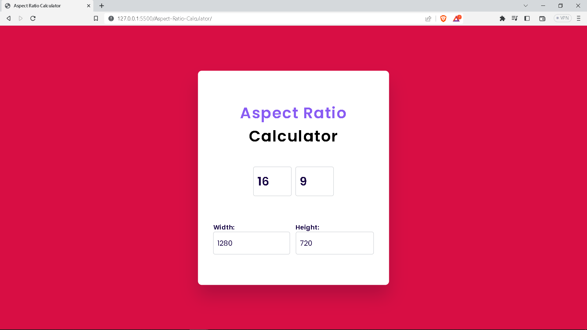

# Aspect-Ratio-Calculator-JS

I have created this Aspect Ratio Calculator webapp by using HTML, CSS, Javascript.

This web app calculate the Width and Height after providing the aspect ratio or vice versa.

# Screenshot

