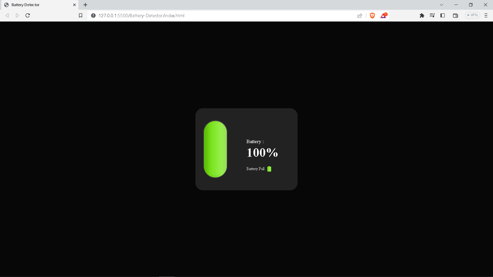

# Battery-Detector-JS

I have created this Device Battery Detector webapp by using HTML, CSS, Javascript.

This web app shows the battery level of device and also shows weather it charging or not

# Screenshot

