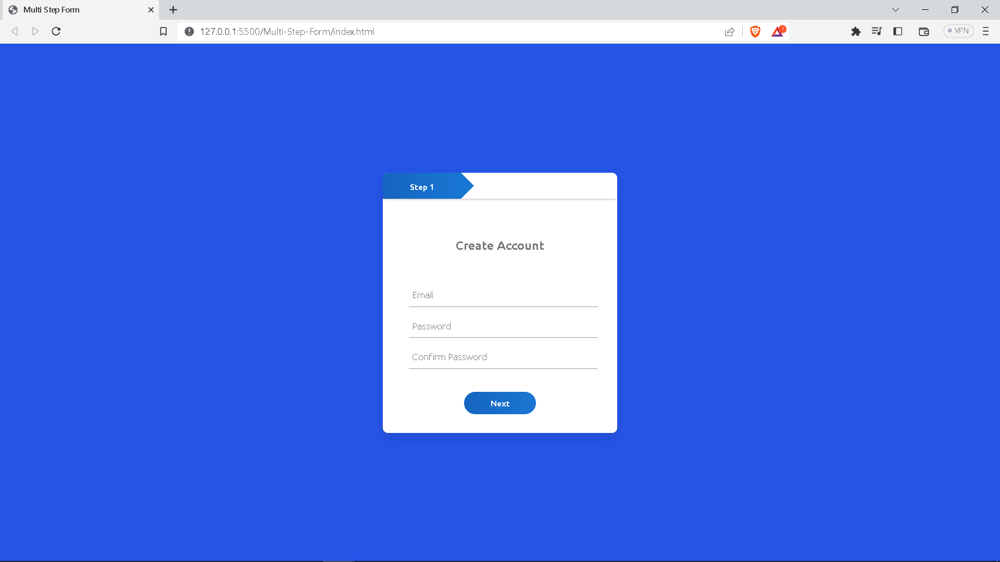
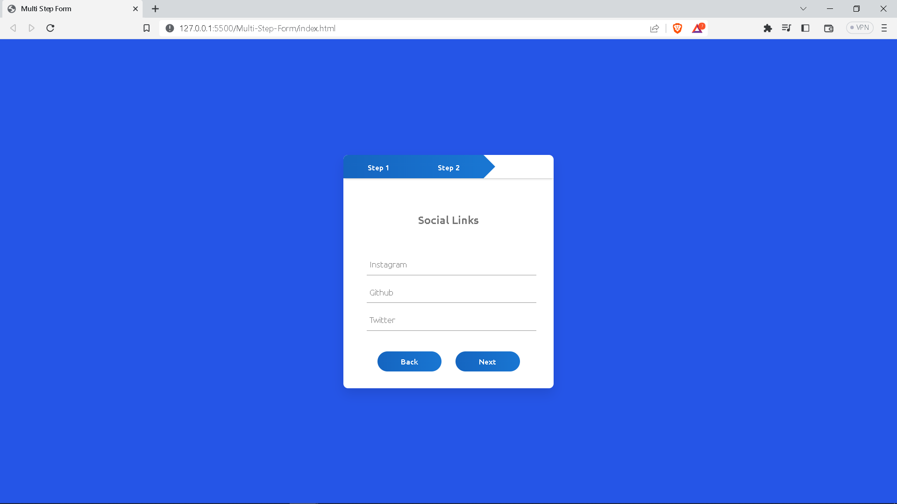
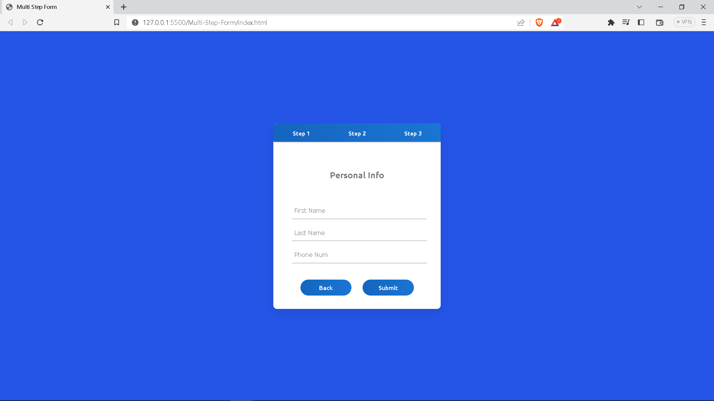

# Multi-Step-Form-JS

I have created this Multi Step Form webapp by using HTML, CSS, Javascript.

In this there are 3 steps in this you can get distinct data from user.

In first step user can provide user details to create user.

In second step user can provide user social links.

In third step user can provide user details like First, last name and Phone number.

# Screenshot

