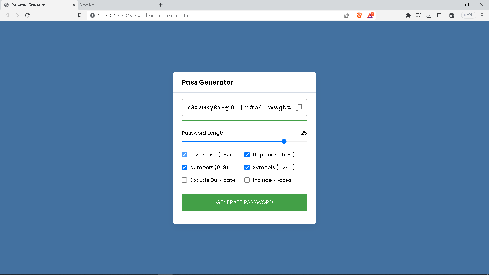

# Password-Generator-JS

I have created this Password Generator webapp by using HTML, CSS, Javascript.

In this web app you can Generate Password, change the length of the password, select the type of password you can to generate like lowercase, uppercase, numbers, symbols, include spaces and exclude duplicate.

# Screenshot

