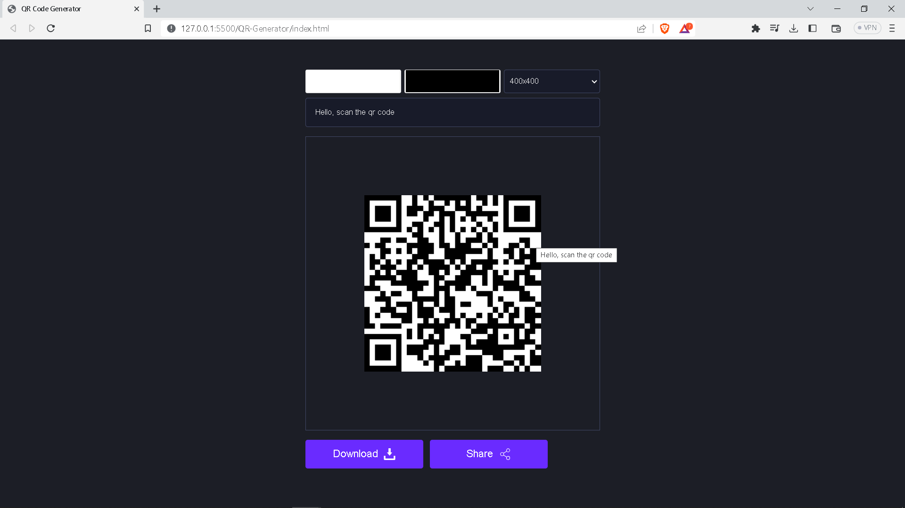

# QR-Generator-JS

I have created this QR Generator webapp by using HTML, CSS, Javascript.

You can create your custom QR Code by providing the text and download and share the QR Code.

# Screenshot

