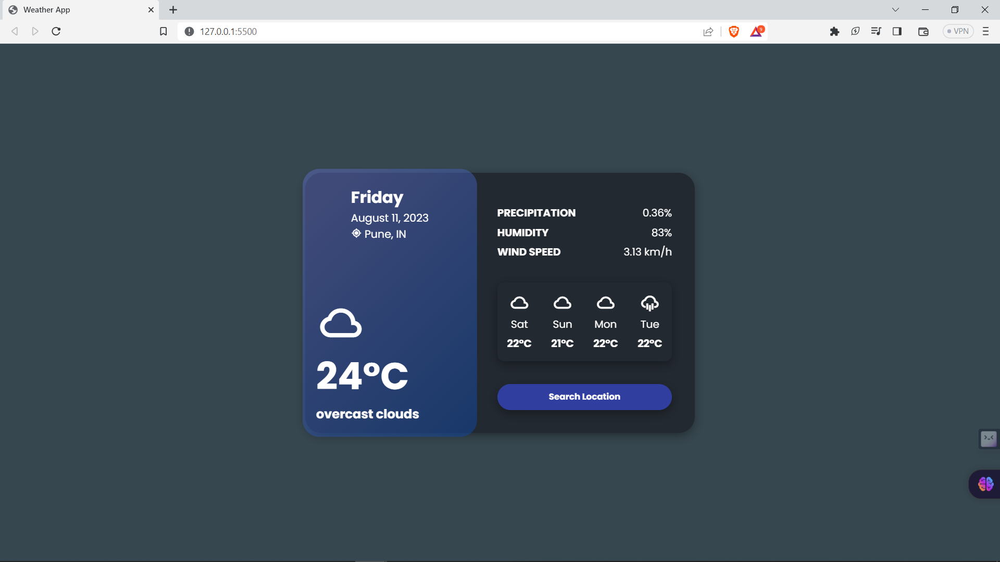

# weather-app-js

I have created this weather webapp by using HTML, CSS, Javascript.

Enter the city name and click search button and it will show the temperature details.

If the city name is not correct it will show 404 city not found.

